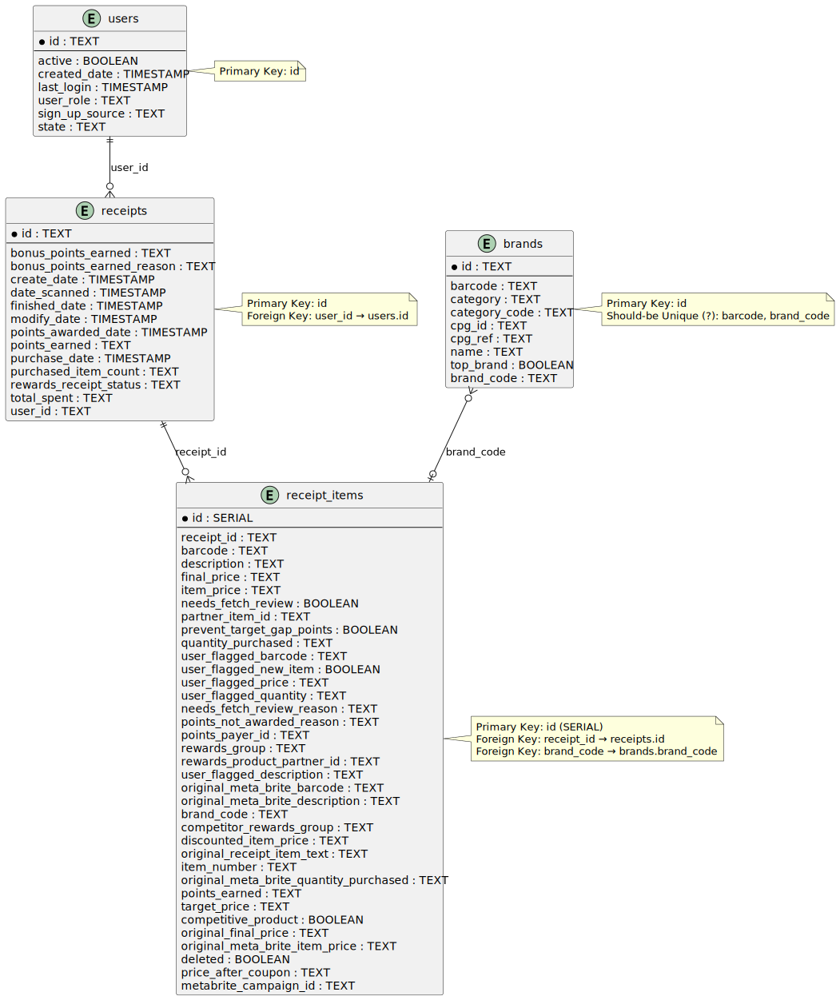

## Processing
The main processing that was performed was teasing out `rewardsReceiptItemList` from the receipts JSON objects in order to load a table I'm calling receipt_items. Sure, Postgres can store JSON arrays, but separating this data into its own model is cleaner and will make querying easier and faster.

## Part One: a New Structured Relational Data Model

This is the relationship model I was able to infer:

<p align="center">

</p>

Two somewhat surprising finds that made actually emposing FK constraints without losing data impossible:

1. It seems that receipt items should logically relate to brands via brand_code, but two problems:
   1. `brands.brand_code` is not UNIQUE (has NULLs, empty strings, and some duplicates)
   2. Evidently there are `receipt_items.brand_code`s that don't show up in `brands.brand_code`. I'm guessing this is a DQ/source completeness issue. 
   
   Examples from the logs:

    ```log
    2025-01-28 00:40:34 - __main__ - ERROR - Error processing line 439: insert or update on table "receipt_items" violates foreign key constraint "receipt_items_brand_code_fkey"
    DETAIL:  Key (brand_code)=(LITEHOUSE) is not present in table "brands".
    2025-01-28 00:40:34 - __main__ - ERROR - Error processing line 446: insert or update on table "receipt_items" violates foreign key constraint "receipt_items_brand_code_fkey"
    DETAIL:  Key (brand_code)=(BETTY CROCKER) is not present in table "brands".
    ```


2. Receipts should relate to users, but again apparently there are users missing from the users table. Some examples from the logs:

    ```log
    2025-01-27 17:18:46 - __main__ - ERROR - Error processing line 15: insert or update on table "receipts" violates foreign key constraint "receipts_user_id_fkey"
    DETAIL:  Key (user_id)=(5ff1e1e9b6a9d73a3a9f10f6) is not present in table "users".
    2025-01-27 17:18:46 - __main__ - ERROR - Error processing line 16: insert or update on table "receipts" violates foreign key constraint "receipts_user_id_fkey"
    DETAIL:  Key (user_id)=(5ff1e1dfcfcf6c399c274ab3) is not present in table "users".
    ```

## Part Two: Queries

- What are the top 5 brands by receipts scanned for most recent month?
  - In my mind, there are 2 ways of going about this (though the difference is really just `count(*)` vs `count(distinct r.id)`), but it apparently doesn't matter (though the logical implications could be significant in a different dataset):

    ```sql
    select ri.brand_code , count(*) -- count(distinct r.id) as an alternative
    from receipts r 
    join receipt_items ri 
        on ri.receipt_id = r.id 
    where DATE_TRUNC('month', r.date_scanned) = (
            SELECT DATE_TRUNC('month', MAX(date_scanned)) - interval '1 month'  -- should yield the latest **full** month
            FROM receipts
        )
      and ri.deleted is null
    group by 1
    order by 2 desc;
    ```

    But this is sort of a failure if we're expecting some real results. There are only a handful with non-null `brand_code`:

    | brand_code  |  count |
    |---|---|
    | BRAND  |  3 |
    | MISSION  |  2 |
    | VIVA  |  1 |

    The difference between the `count(*)` and `count(distinct r.id)` is that in the former we tally up the brands by receipt items. If it appears n times on a receipt, it counts n towards the tally. This answers the basic question of the most purchased brand. But what if there are a handful of super brand-loyal customers skewing the results? Or if we want to more generally get an idea of brand awareness?
    That's what the latter would give an idea of: if a brand appears on a receipt n times, count it as one. That way we get a sense of across how many receipts the brand appears (we could go deeper with this and bring it up to the customer level, but again, for this dataset there are too many NULLs for any of this to matter).

- How does the ranking of the top 5 brands by receipts scanned for the recent month compare to the ranking for the previous month?
  - Apparently the previous month (January) had basically all the sales if we're going by receipt_items:

  ```sql
    select ri.brand_code , count(*) ct_total, count(distinct r.id) ct_receipts
    from receipts r 
    join receipt_items ri 
        on ri.receipt_id = r.id 
    where DATE_TRUNC('month', r.date_scanned) = (
            SELECT DATE_TRUNC('month', MAX(date_scanned)) - interval '2 month'  -- should yield the latest **full** month
            FROM receipts
        )
      and ri.deleted is null
    group by 1
    order by 2 desc;
  ```

  If we go with interpretation 1, the top 5 are:

    | brand_code  |  count | count_receipts |
    |---|---|---|
    | HY-VEE | 291 | 10 |
    | BEN AND JERRYS | 180 | 32 |
    | PEPSI | 93 | 23 |
    | KROGER | 89 | 5 |
    | KLEENEX | 88 | 21 |

  With interpretation 2 (just changing the ordering clause in the above statement to `order by 3 desc`):

    | brand_code  |  count | count_receipts |
    |---|---|---|
    | BEN AND JERRYS | 180 | 32 |
    | FOLGERS | 38 | 23 |
    | PEPSI | 93 | 23 |
    | KELLOGG'S | 27 | 22 |
    | KRAFT | 60 | 22 |

  So while HY-VEE has a lot of volume (receipt line items), FOLGERS is showing up on more receipts.

- When considering average spend from receipts with 'rewardsReceiptStatus’ of ‘Accepted’ or ‘Rejected’, which is greater?
  - Well, I'll assume we mean 'FINISHED' and 'REJECTED':

  ```sql
    select rewards_receipt_status, round(avg(total_spent::numeric),2)
    from receipts r 
    where rewards_receipt_status in ('REJECTED', 'FINISHED')
    group by 1
  ```

    | rewards_receipt_status | avg |
    |---|---|
    | REJECTED | 23.33 |
    | FINISHED | 80.85 |

  But I'm suspect of some receipt records e.g. those belonging to user '5fc961c3b8cfca11a077dd33' which look almost like duplicates. In fact there are many records which would basically be duplicate other than for the dates and the ID - probably a result of the data synthesis. I won't attempt data clean-up.

- When considering total number of items purchased from receipts with 'rewardsReceiptStatus’ of ‘Accepted’ or ‘Rejected’, which is greater?
  - Same as before, FINISHED (Accepted) is a clear winner:

  ```sql
    select rewards_receipt_status, count(*)
    from receipts r 
    join receipt_items ri 
        on ri.receipt_id = r.id
    where rewards_receipt_status in ('REJECTED', 'FINISHED')
      and ri.deleted is null
    group by 1
  ```

    | rewards_receipt_status | count |
    |---|---|
    | REJECTED | 164 |
    | FINISHED | 5918 |

- Which brand has the most spend among users who were created within the past 6 months?
  - BEN AND JERRYS

  ```sql
    select brand_code, sum(ri.final_price ::numeric)
    from receipts r 
    join receipt_items ri 
        on ri.receipt_id = r.id
    join users u 
        on u.id = r.user_id 
    where u.created_date >= (select max(date_scanned) - interval '6 months' from receipts)
      and ri.deleted is null
    group by 1
    order by 2 desc
  ```

- Which brand has the most transactions among users who were created within the past 6 months?
  - Considering a transaction == receipt item, HY-VEE
  - Otherwise, if transaction == receipt, BRAND (difference is simply `count(distinct r.id)`)

  ```sql
    select brand_code, count(*)
    from receipts r 
    join receipt_items ri 
        on ri.receipt_id = r.id
    join users u 
        on u.id = r.user_id 
    where u.created_date >= (select max(date_scanned) - interval '6 months' from receipts)
      and ri.deleted is null
    group by 1
    order by 2 desc
  ```


## Part Three: Data Quality
   
I've already alluded to some potential DQ issues, but here are a few more:

There are a handful of duplicate barcodes in `brands` that I discovered when trying to load with a UNIQUE constraint - I'm *assuming* these should be unique:

```log
2025-01-27 22:39:34 - __main__ - ERROR - Error processing line 299: duplicate key value violates unique constraint "brands_barcode_key"
DETAIL:  Key (barcode)=(511111504139) already exists.
2025-01-27 22:39:34 - __main__ - ERROR - Error processing line 412: duplicate key value violates unique constraint "brands_barcode_key"
DETAIL:  Key (barcode)=(511111504788) already exists.
2025-01-27 22:39:35 - __main__ - ERROR - Error processing line 536: duplicate key value violates unique constraint "brands_barcode_key"
DETAIL:  Key (barcode)=(511111204923) already exists.
2025-01-27 22:39:35 - __main__ - ERROR - Error processing line 651: duplicate key value violates unique constraint "brands_barcode_key"
DETAIL:  Key (barcode)=(511111305125) already exists.
2025-01-27 22:39:36 - __main__ - ERROR - Error processing line 1012: duplicate key value violates unique constraint "brands_barcode_key"
DETAIL:  Key (barcode)=(511111605058) already exists.
2025-01-27 22:39:36 - __main__ - ERROR - Error processing line 1015: duplicate key value violates unique constraint "brands_barcode_key"
DETAIL:  Key (barcode)=(511111704140) already exists.
2025-01-27 22:39:36 - __main__ - ERROR - Error processing line 1071: duplicate key value violates unique constraint "brands_barcode_key"
DETAIL:  Key (barcode)=(511111004790) already exists.
```

There are duplicates by brand_code, too:
```sql
select brand_code, count(*) from brands group by 1 order by 2 desc
```

Just GOODNITES and HUGGIES, however. The other duplicates and NULLs and the empty string (should clean that up and store NULLs as empty strings). Lastly(?), users also has a handful of duplicates.

In the case of brands, I decided to remove the UNIQUE constraint for the sake of having the data (plus I'm not positive the barcode HAS to be unique - I lack that domain knowledge), but for users I kept the constraint, meaning that the first record in the source file made its way to the database while the duplicates were silently ignored (well, they're logged).

Some other quality checks:
- Does `receipts.total_spent` line up with the sum of receipt items `final_price`?
  - There are a handful of cases where it does not:

  ```sql
    select * from (
        select r.id, sum(ri.final_price::numeric) sum_price, max(r.total_spent::numeric) total_spent
        from receipt_items ri 
        join receipts r 
            on r.id = ri.receipt_id 
        where ri.deleted is null
        group by 1
    )
    where sum_price <> total_spent
  ```

- Along the same vein, the sum of `receipt_items.quantity_purchased` and the max of `receipts.purchased_item_count` don't line up (and it's apparently even worse when coalescing with `user_flagged_quantity` i.e. `sum(coalesce(ri.quantity_purchased::numeric, ri.user_flagged_quantity::numeric))`)
- This one's kind of fun: users who scanned an item before they were created as users in the system. Maybe not impossible if you can retroactively tie a past transaction to a user *after* they've signed up. Most of the differences come down to milliseconds, but some like user 5ff793dd04929111f6e90c69 are days apart:

  ```sql
  with first_scans as (
  select *, min(date_scanned) over (partition by user_id) first_scan_dt
  from receipts r 
  )
  select u.id, created_date - fs.first_scan_dt
  from first_scans fs 
  join users u
    on u.id = fs.user_id
  where u.created_date > fs.first_scan_dt
  ```

I'm sure there's more DQ issues to find but I have to stop at some point :)

## Part Four: Stakeholders Communication

> Hey Sarah, hope your day is off to a good start.
> 
> I for one have found myself in the dark alleys of data land and I could really use some help demistifying a couple of things:
> 
> 1. Can brands share the same barcode? Does that make any sense? I'm finding a handful e.g.:
>    1. Barcode 511111504139 is tied to both CHRISXYZ and PACE
> 2. What does a receipt having a purchase date before its scanned date mean? I'm trying to figure out if this is a data quality issue or if I'm just missing some domain context.
> 3. Can you tell me the difference between points and *bonus* points? I'm seeing two distinct but very similar columns in our receipts data.
> 4. Why would an item be flagged as needing a review and should I treat that case specially? Should I leave it out of reporting?
> 
> I think that's all I have for now, but I'll let you know if anything else comes up. I appreciate your help with these questions!